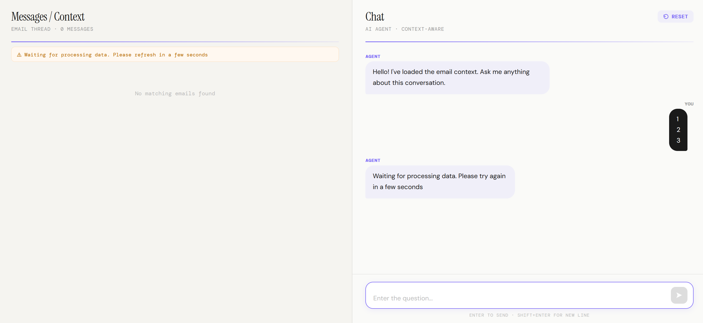
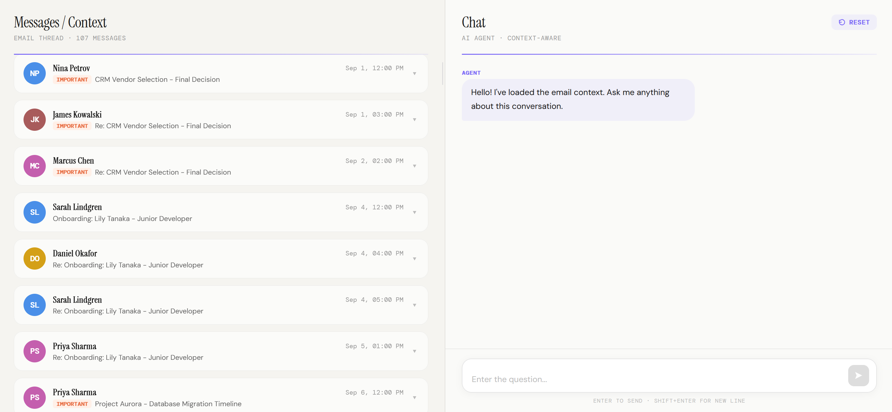
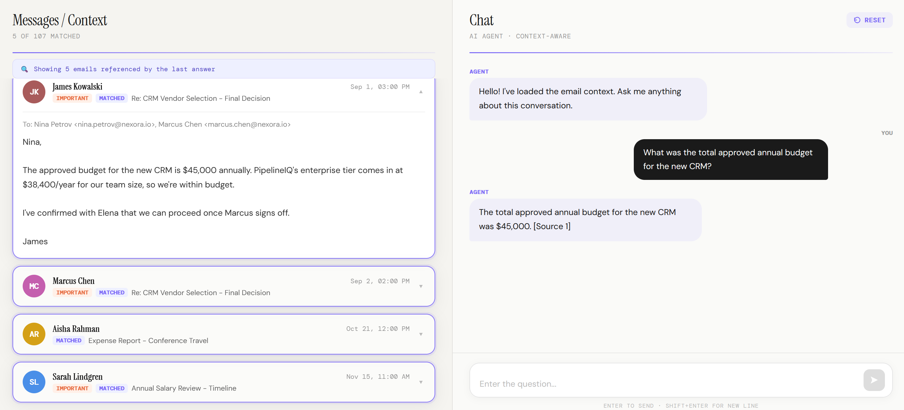
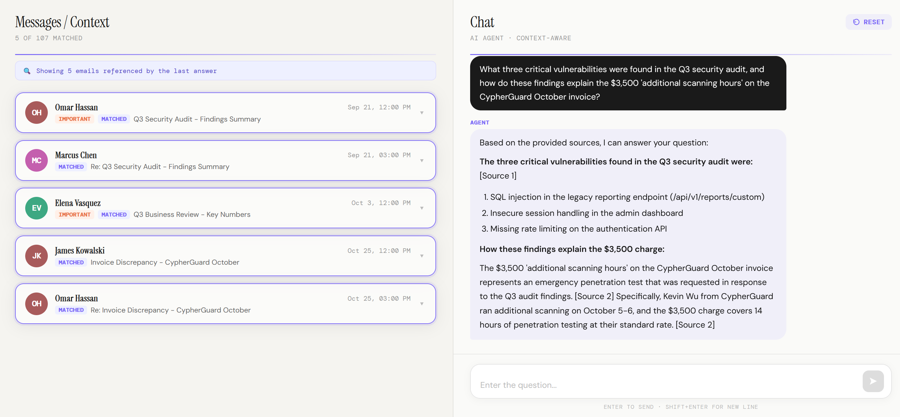
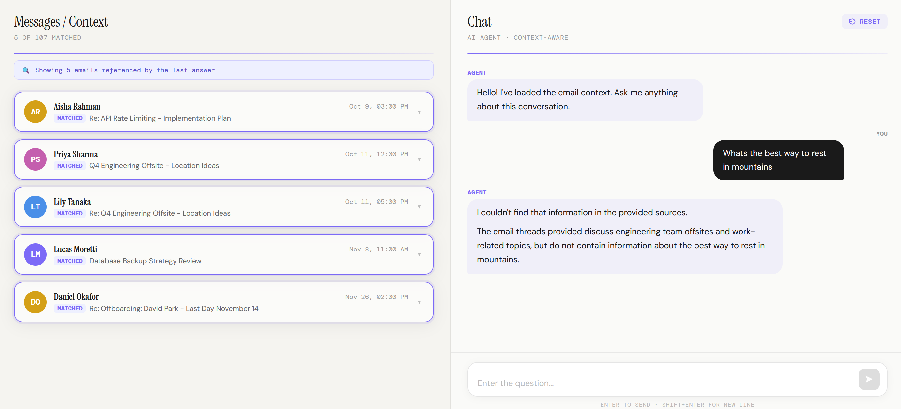

# Inbox QA — Project Demo

> Ask natural-language questions about your Gmail inbox.

---

## Architecture

```
┌─────────────────────────────────────────────────────────────┐
│                       QUERY FLOW                            │
│                                                             │
│   User Question                                             │
│          │                                                  │
│          ▼                                                  │
│   ChromaDB  ──► top-K nearest emails (by vector distance)   │
│          │                                                  │
│          ▼                                                  │
│   RagEngine  ──► builds prompt with retrieved contexts      │
│          │                                                  │
│          ▼                                                  │
│   Claude API  ──► grounded, cited answer                    │
│          │                                                  │
│          ▼                                                  │
│   React UI / REST API response                              │
└─────────────────────────────────────────────────────────────┘
```

## Interface

> At the start, the system processes the uploaded `.mbox` file and builds the vector database. So you can not ask questions until that initial setup is complete.


> Once that's done, you can the all emails and ask questions about them:



## Example Queries & Answers

### Query 1 — Fact Retrieval

**Question:**
```
What was the total approved annual budget for the new CRM?
```

**The Right Answer**:
```
Budget is $45,000.
```

**Answer:**
> Also you can see the retrieved contexts (3 emails from the CRM thread) and the model's answer citing those sources:

---

### Query 2 — Complex Connection

**Question:**
```
What three critical vulnerabilities were found in the Q3 security audit, and how do these findings explain the $3,500 'additional scanning hours' on the CypherGuard October invoice?
```

**The Right Answer**: 
```
Vulnerabilities: SQL injection, insecure session handling, and missing rate limiting. The $3,500 was for an emergency pen test authorized by Omar to address those findings.
```

**Answer:**



---

### Query 3 — Out-of-scope question (hallucination guard)

**Question:**
```
Whats the best way to rest in mountains?
```


**The Right Answer**:
```
I couldn't find that information in the provided sources.
```

**Answer:**

> The model refuses to speculate. You can still the nearest emails it retrieved, it won't use then to answer but show because of the nearest neighbour search


---

## Cost Profile

| Model | Input tokens (est.) | Output tokens (est.) | Cost per query |
|-------|---------------------|----------------------|----------------|
| `claude-haiku-4-5`          | ~1500-5000 | ~100-1000 | ~$0.001 |
| `claude-sonnet-4-6`         | ~1500-5000 | ~100-1000 | ~$0.02  |
| Web agent (baseline)        | —          | —         | ~$0.15-0.05 |
